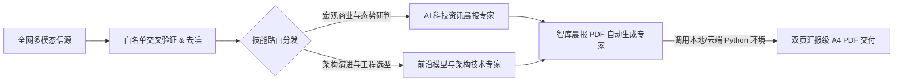

# AI-Business-Intelligence-Daily-Pipeline
> **基于 Prompts-as-Code 的 AI科技与商业资讯收集工作流  / AI business intelligence daily collection workflow based on Prompts-as-Code.**

本项目包含一套系统性提示词库（Prompt Framework），旨在通过大语言模型（LLM）构建一条从“权威信源采集”到“硬核技术研判”，再到“汇报级双页 PDF 自动编译”的晨报制作管道。

无论是为了宏观商业决策，还是底层的技术架构选型，该工作流均严格遵循“高信噪比、过滤营销废话、关注量化指标”的原则，旨在提供前沿，专业，严谨的晨报服务。

---

## 架构工作流 (Workflow Pipeline)

本工作流采用模块化设计，通过AI Skills, 串联起完整的生产线：



---

## 仓库结构 (Repository Structure)

```text
ai-briefing-agent-pipeline/
├── README.md                                 # 项目说明与工作流架构指引
├── skills/                                   # 核心智能体提示词库 (Prompts as Code)
│   ├── skill_AI 科技资讯晨报专家China.md        # [宏观视角] 商业科技资讯过滤与三段式早报 关注中国资讯
│   ├── skill_AI 科技资讯晨报专家Global          # [宏观视角] 商业科技资讯过滤与三段式早报 关注全球资讯
│   ├── skill_AI前沿模型与架构技术资讯专家.md        # [工程视角] 面向 CTO/架构师的技术雷达与指标分析
│   └── skill_deloitte-style_executive_briefing # [晨报生成] 
└── examples/                                 # 产出样例展示 (即将上线)
    ├── sample_daily_briefing.md              # Markdown 格式晨报样本文本
    └── sample_briefing_output.pdf            # 编译生成的标准双页 PDF 样张
```

---

## 核心技能矩阵 (Skills Matrix)

本项目核心包含三个 Prompt 文件，分别对应不同的业务切面与技术约束：

### 1. 中国科技资讯晨报专家 (China Business & Strategy)
- **定位**：资深科技与财经智库分析师。
- **核心机制**：
  - **白名单强制过滤**：仅限头部实验室官方源（如 智谱, 字节跳动）与顶级财媒（如 财新, 晚点），绝对屏蔽低质营销号。
  - **动态时间窗**：根据周一至周五智能调整回溯时间（24h~72h）。
  - **三段式归因**：每条深度资讯必须包含 `[核心事实] -> [权威解读] -> [商业影响]`。


### 2. 全球科技资讯晨报专家 (Global Business & Strategy)
- **定位**：资深科技与财经智库分析师。
- **核心机制**：
  - **白名单强制过滤**：仅限头部实验室官方源（如 DeepMind, OpenAI）与顶级财媒（如 Bloomberg, FT），绝对屏蔽低质营销号。
  - **动态时间窗**：根据周一至周五智能调整回溯时间（24h~72h）。
  - **三段式归因**：每条深度资讯必须包含 `[核心事实] -> [权威解读] -> [商业影响]`。

### 3. 前沿模型与架构技术专家 (CTO & Engineering Radar)
- **定位**：资深 CTO 兼首席人工智能架构师。
- **核心机制**：
  - **硬核指标派**：摒弃纯概念吹捧，要求强制汇报 License 许可协议、实测 TTFT（首字延迟）、并发吞吐、显存/算力开销（VRAM 要求）。
  - **红线机制**：明确设立“五不采纳”红线（如无代码无权重的套壳演示、严重刷榜模型等一律剔除）。
  - **落地选型**：提供明确的“技术选型与替换建议”，指出系统的已知坑点与工程瓶颈。

### 4. 智库晨报 PDF 自动生成专家 (Automated Publisher)
- **定位**：自动化出版排版引擎。
- **核心机制**：
  - **代码执行 (Code Execution)**：引导模型自动编写 Python `reportlab` 脚本完成编译。
  - **严苛版式控制**：确保成品直接具备分发展示级别。

---

## 快速上手 (Quick Start)

这些 Prompt 文件采用标准 Markdown 结构编写，具备极强的跨平台兼容性与可扩展性。您可以将它们部署在以下环境中：

**云端主流 Agent 平台**
   您可以直接将 md 文件上传到主流大模型平台（如具备复杂指令遵循能力的模型）的中作为定制化智能体的系统指令运行。对于 PDF 自动生成专家，确保该运行环境开启了代码执行功能。

---

## 许可证 (License)

本项目采用 [MIT License](LICENSE) 开源协议。欢迎提交 PR 共同完善这套高信噪比资讯过滤工作流。
